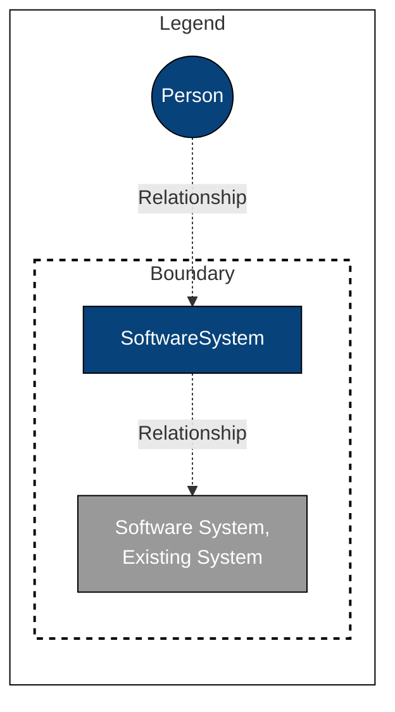
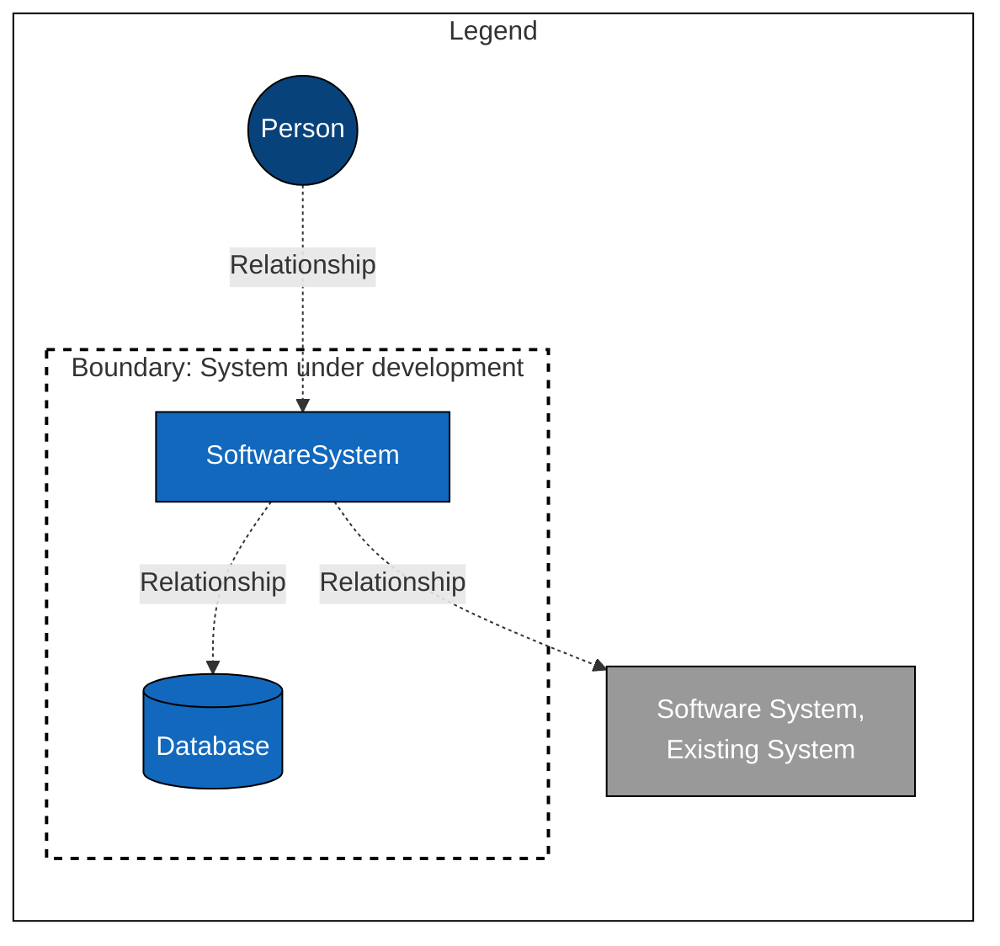
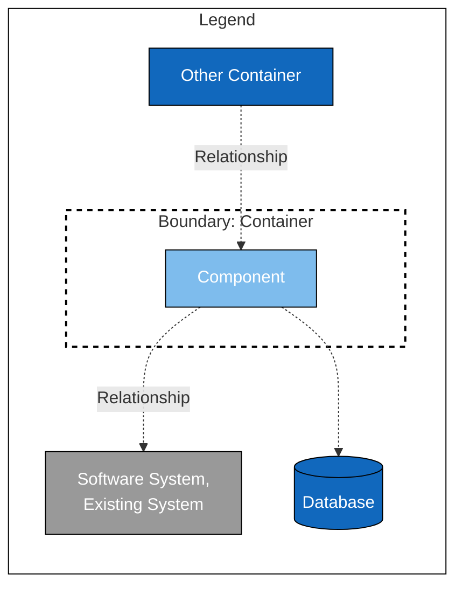

# C4 Model and Mermaid

Using the excellent [C4 model](https://c4model.com/) to create diagrams in [mermaid](https://github.com/mermaid-js/mermaid).

All the templates have been prepared and tested with [Mermaid Live Editor](https://mermaid.live/).

## Level 1: Context 

## Level 2: Container

Note: app and browser are containers too

## Level 3: Component

