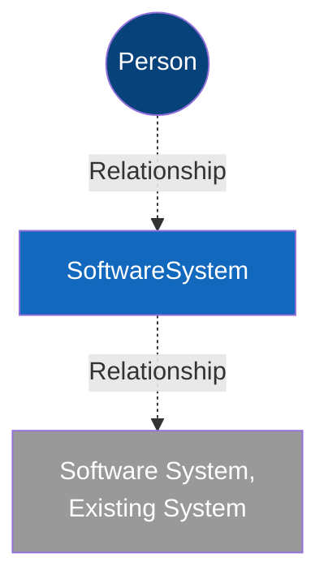

# c4model_mermaid

Using the excellent [C4 model](https://c4model.com/) to create diagrams in [mermaid](https://github.com/mermaid-js/mermaid).

## Context 

```mermaid
graph TD
    %% C4 classes c4model.com%%
    classDef person fill:#08427b,color:#FFF;
    classDef software fill:#1168bd,color:#FFF;
    classDef existing fill:#999999,color:#FFF;

    Person((Person)):::person-.->|Relationship| SoftwareSystem:::software
    SoftwareSystem-.->|Relationship| ExistingSystem["Software System,<br>Existing System"]:::existing
```
